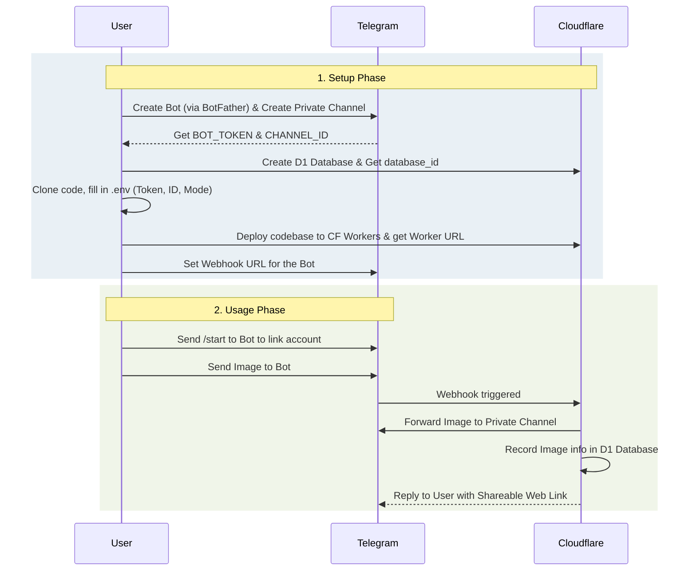

# Telegram Bot Image Manager

Telegram Bot Image Manager is a modern, serverless solution for uploading, sharing, and managing images via a Telegram bot. Built on the Cloudflare Edge network, it utilizes Cloudflare Workers for logic and Cloudflare D1 for database storage. Easily build your own private cloud image hosting service with zero maintenance.

*Inspired by the open-source [cf-pages/Telegraph-images](https://github.com/cf-pages/Telegraph-Images) project.*

## Introduction

Users can simply send an image to the bot, which acts as a bridge to store the image securely in a private Telegram Channel and returns a permanent, shareable web link. It features a robust permission system, supporting both Single-User and Family/Multi-User modes with whitelisting and blacklisting capabilities. An intuitive, token-secured Admin Web UI allows administrators to easily manage image visibility and user access directly from their browser.

### Setup & Business Workflow


## Features

- **Bot-Driven Storage**: Send images directly to your bot; it securely stores them in a private Telegram Channel and returns a shareable web link.
- **Access Control & Whitelist**: 
  - `single` mode: Only the initial admin or explicitly allowed users can upload.
  - `multi` (Family) mode: Supports a full Whitelist/Blacklist mechanism. If `REQUIRE_APPROVAL` is enabled, new users are automatically placed in a `'pending'` state awaiting admin approval. Otherwise, they are instantly verified.
- **Adaptive Web UI Dashboard**: 
  - Generate a 2-hour encrypted login link directly from the bot via `/dashboard`.
  - **Admins**: Can manage all images globally, and approve/ban normal users via the Dashboard.
  - **Normal Users**: Get a personalized dashboard where they can exclusively view, manage, and toggle the public visibility of *their own* uploaded images.
- **Synchronized Deletion**: Deleting an image in the Web UI can automatically delete the source file from your Telegram channel, saving space and preventing leaks.
- **Modern Edge Stack**: Built with Hono, Tailwind CSS v4, Alpine.js, and Drizzle ORM on Cloudflare Workers and D1 Database.
## Deployment

### 1. Environment Variables (`.env`)
You must create a `.env` file referencing `.env.example`.
- `BOT_TOKEN`: Get this from Telegram's `@BotFather`.
- `CHANNEL_ID`: Create a Private Telegram Channel. Promote your bot as Admin there. Send a message to the channel and forward it to `@userinfobot` to get the numerical ID (should start with `-100`).
- `ACCESS_MODE`: `single` (private personal use) or `multi` (friends/family can request to join).
- `REQUIRE_APPROVAL`: `true` (admins must review/whitelist anyone who joins via Web UI) or `false` (everyone who knows the bot can use it instantly).
- `WEBHOOK_SECRET`: A secure random password of your choice. Used to ensure requests only come from Telegram. *(Tip: Run `npm run generate-secret` to easily generate a secure one!)*
- `WEBHOOK_PATH_SECRET`: A secure random short path to obfuscate your webhook URL (e.g. `.../webhook/<WEBHOOK_PATH_SECRET>`).
- `BASE_URL`: The public URL where your Cloudflare worker is accessible, e.g., `https://my-app.workers.dev` (No trailing slash).
- `ADMIN_URL`: *(Optional)* A custom domain dedicated specifically for accessing the Web Admin UI (e.g. `https://admin.yourdomain.com`). Falls back to `BASE_URL` if not set.
- `WEBHOOK_URL`: *(Optional)* A custom domain dedicated specifically for Telegram webhook requests (e.g. `https://api.yourdomain.com`). Falls back to `BASE_URL` if not set.
- `ENABLE_PUBLIC_CHECK`: `true` or `false`. If `true`, the bot will query the database for every image request to check if it's public. If `false` (default), it skips the database check for maximum performance (0 D1 reads for public traffic).

### 2. Automated Deployment (If you have Wrangler / Cloudflare CLI installed locally)
```bash
# 1. Install dependencies
npm install

# 2. Generate secure webhook secrets (Recommended)
npm run generate-secret
# -> Copy the generated values. For local use, place them in a `.dev.vars` file.

# 3. Create the D1 Database
# First, copy the example config if you haven't already:
cp wrangler.jsonc.example wrangler.jsonc

npx wrangler d1 create telegrambot_images_db
# -> Copy the output "database_id" into your wrangler.jsonc file

# 4. Apply the database schema
npm run cf-typegen
npm run db:generate

# Apply to your local testing database:
npm run db:migrate:local
# Apply to your remote Cloudflare database:
npm run db:migrate

# 5. Push Environment Variables securely to Cloudflare
# Wrangler does NOT upload your local .dev.vars automatically. Let's upload them securely:
npx wrangler secret bulk .dev.vars 
# (Alternatively, you can manually enter them in the Cloudflare Dashboard -> Settings -> Variables and Secrets)

# 6. Deploy to Cloudflare Network
npm run deploy

# 7. Set up the Webhook
# After deploying, you will receive a URL like https://your-project.your-subdomain.workers.dev
# Open this URL in your browser to auto-register the webhook:
# https://your-project.your-subdomain.workers.dev/setWebhook

> ⚠️ **Important Note:** Whenever you regenerate your `generate-secret`, or modify `WEBHOOK_SECRET` / `WEBHOOK_PATH_SECRET` in the future, you **MUST** re-visit the `/setWebhook` URL in your browser to re-sync the changes with Telegram's servers.
```

### 3. Manual Deployment (Via Cloudflare Dashboard directly)
1. Fork or Clone this repository.
2. In the Cloudflare Dashboard, create a new **Worker** and a **D1 Database**.
3. Go to the Worker's **Settings -> Bindings**, and bind your D1 Database to the variable name `DB`.
4. Go to **Settings -> Variables and Secrets**, and manually input `BOT_TOKEN`, `CHANNEL_ID`, `ACCESS_MODE`, `REQUIRE_APPROVAL`, `WEBHOOK_SECRET`, `WEBHOOK_PATH_SECRET`, and `BASE_URL`.
5. Connect your GitHub repository to Cloudflare Pages/Workers for automatic CI/CD deployment.
6. Trigger the Webhook by visiting your deployed URL `https://.../setWebhook`.

### Bot Commands Configuration

After creating your bot in BotFather, you can set these commands using `/setcommands`:
- `start` - Link your Telegram account and check permissions
- `upload` - Interactive prompt to upload an image
- `dashboard` - Get a secure 2-hour link to access the Web Admin Panel
- `setadmin` - (Admin only) Set a user as admin: `/setadmin <tg_id>`
- `deladmin` - (Admin only) Revoke admin rights from a user
- `pending` - (Admin only) List all users awaiting approval
- `approve` - (Admin only) Approve a pending user: `/approve <tg_id>`
- `banned` - (Admin only) Ban a user from using the bot: `/banned <tg_id>`

## Industrial-Grade Features

- **Security Hardening**: Includes automatic sanitization of image captions to prevent XSS and Markdown injection attacks.
- **Social Media Preview (Open Graph)**: Shared links automatically generate rich preview cards with images and captions on Telegram, Discord, and Twitter.
- **Extreme Performance & Caching**: Integrated Cloudflare **Cache API** on the edge. High-traffic images are served directly from the edge network with **zero D1 database reads** and zero latency.
- **Link Health Monitoring**: Automatically detects and marks images as "Broken" in the database if the source file is deleted from Telegram, providing a visual warning in the Admin UI.
- **Telegraph-Images Migration Support**: Native compatibility for legacy Telegraph-Images URL patterns (`/file/<tg_file_id>.jpg`).
- **Multi-Environment Support**: Clean architecture allowing you to maintain multiple bot instances (e.g., Production, Staging) using a single codebase via Wrangler Environments.
- **Advanced Dashboard**: Features server-side pagination and real-time search, making it effortless to manage thousands of images without performance degradation.
