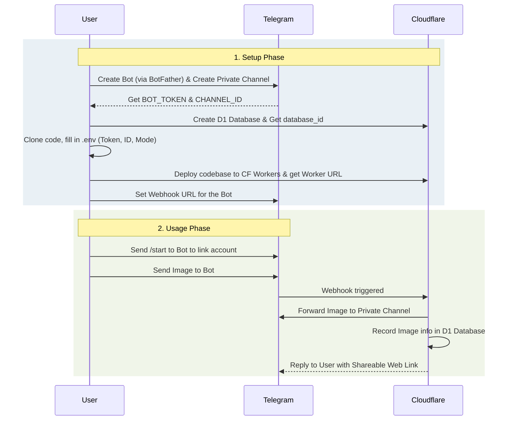

# Telegram Bot Image Manager

Telegram Bot Image Manager is a modern, serverless solution for uploading, sharing, and managing images via a Telegram bot. Built on the Cloudflare Edge network, it utilizes Cloudflare Workers for logic and Cloudflare D1 for database storage. Easily build your own private cloud image hosting service with zero maintenance.

*Inspired by the open-source [cf-pages/Telegraph-images](https://github.com/cf-pages/Telegraph-Images) project.*

## Introduction

Users can simply send an image to the bot, which acts as a bridge to store the image securely in a private Telegram Channel and returns a permanent, shareable web link. It features a robust permission system, supporting both Single-User and Family/Multi-User modes with whitelisting and blacklisting capabilities. An intuitive, token-secured Admin Web UI allows administrators to easily manage image visibility and user access directly from their browser.

### Setup & Business Workflow

## Features

- **Bot-Driven Storage**: Send images directly to your bot; it securely stores them in a private Telegram Channel and returns a shareable web link.
- **Access Control**: Supports Single-User or Multi-User (Family) mode with strict Whitelist and Blacklist management.
- **Admin Web UI**: Generate a 2-hour encrypted login link from the bot to manage images and permissions securely from any browser.
- **Modern Edge Stack**: Built with Hono, Tailwind CSS v4, Alpine.js, and Drizzle ORM on Cloudflare Workers and D1 Database.

## Deployment

*(Deployment instructions to be provided...)*

### Bot Commands Configuration

After creating your bot in BotFather, you can set these commands using `/setcommands`:
- `start` - Link your Telegram account and check permissions
- `upload` - Interactive prompt to upload an image
- `admin` - Get a secure 2-hour link to access the Web Admin Panel
- `setadmin` - (Admin only) Set a user as admin: `/setadmin <user_id> [nickname]`
- `deladmin` - (Admin only) Revoke admin rights from a user
